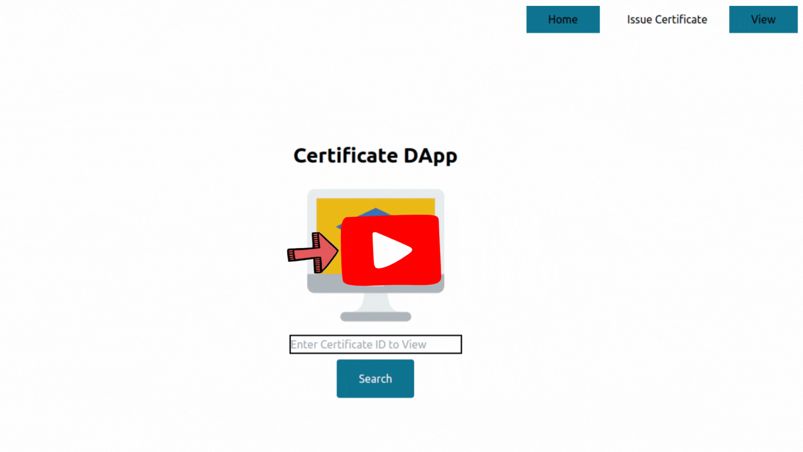

# 🎓 **CertiLedger** 🚀

Welcome to **CertiLedger**, a decentralized application (DApp) for issuing and verifying blockchain-backed certificates using the Ethereum blockchain. CertiLedger ensures that certificates are secure, tamper-proof, and transparent for both issuers and recipients.

## 🎯 Purpose

The DApp is designed to allow educational institutions or other organizations to issue tamper-proof certificates on the blockchain. Users can retrieve certificates by providing the certificate ID, ensuring trust, transparency, and decentralization.

---
## 📦 **Technologies Used**

-   
  
-   
  
-  
 
-    
  
-    

-  

## 📢 Prerequisites
- NodeJS 16.x

## Getting Started 🚀

Follow these steps to set up the project locally.

## 1. Clone the repository

First, clone the repository from GitHub:

```bash
git clone https://github.com/Manufg07/CertiLedger.git

```
## 2. Navigate into the project directory
```bash
cd UI

```
## 3. Install Dependencies and Start the React App
```bash
npm install

```

## 4. Set up environment variables

Create a .env file in the root directory to store your sensitive data. Add the following content, replacing your_infura_project_id and your_private_key with the actual values
```bash
REACT_APP_PRIVATE_KEY=private_key
```
### 5. Add a main network to hardhat.config.
- here im using sepolia and infura 
- add your api key for your sepolia from infura
- add your metamask private key 
eg.
```
module.exports = {
  defaultNetwork:"infurasepolia",
  networks: {
    infurasepolia: {
      url :"your api key of infura or any other accounts",
      accounts:["your metamask private key"]
    }
  },
  solidity: "0.8.20",
};
```
```
npx hardhat node
```
open another terminal in vscode(ctrl+shift+`)

```
npx hardhat ignition deploy ignition/modules/Cert.js
``` 

### 6. Go to folder src/SCdata

- add Abi code to cert.json file
- add deployed address to deployedaddress.json(deployed address will get after deploying the contract)


open another terminal in vscode(ctrl+shift+`)
```
npm run dev
```
- connect your metamask
- issue certificate
- enter details
- make payment in metamask
- after metamask confirm get you certificate by enter your uinique id

## Demo 📹

<a href="https://youtu.be/-ejMrWSRrXs" target="_blank">
  
</a><br>

    
## 📦 Planned Updates
- MetaMask Compatability
- UI Updates
- Mobile View
- Production Release
- Desktop App

## 🎗️ Contributing

inspiration, and innovation. Every contribution you offer is deeply valued.

Should you have ideas to enhance this, kindly fork the repository and initiate a pull request. Alternatively, you can open an issue and tag it with enhancement. Remember to star the project! Many thanks!

1. Fork the Project
2. Create your Feature Branch (git checkout -b feature/<feature_name>)
3. Commit your Changes (git commit -m '<feature_name>_added')
4. Push to the Branch (git push origin feature/<feature_name>)
5. Open a Pull Request

## 📜 License

This project is licensed under the MIT license -  see the [LICENSE.md](LICENSE) file for details.
